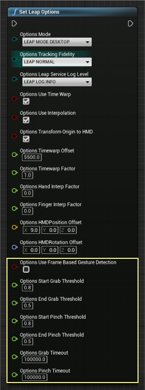

LeapUnreal
====================

[](https://github.com/leapmotion/leapunreal/releases)

The official [Ultraleap](http://ultraleap.com) plugin for the Unreal Engine 4. Compatible with Ultraleap Gemini V5.2 Hand Tracking Software.

For information on migrating from earlier releases of the Hand Tracking Software, see the [Migration Guide](https://developer.leapmotion.com/migration-guide).

You can use convenience blueprints to just select and play or use a custom approach via blueprints or C++. See relevant sections for details

Additionally, further UE4 modules and examples can be found at https://github.com/leapmotion/LeapUnrealModules.

# Setup

Make sure you have [the latest Ultraleap Hand Tracking Software](https://developer.leapmotion.com/tracking-software-download) installed (this plugin requires V4 or newer)

1. Open or create a new project.
2. Download the [latest release](https://github.com/leapmotion/LeapUnreal/releases) of the LeapUnreal plugin and SDK (make sure to use the .zip link)
3. Create a Plugins folder in your project root folder if one doesn't already exist.
4. Drag the unzipped LeapUnreal plugin into the project's Plugins folder
5. The plugin should be enabled and ready to use. If not, enable it.
6. Use our Unreal Examples for object interaction.


#### Quick Setup Video

Watch this quick setup video to get up and running fast

[](https://youtu.be/afbgRiC4fVk)

# How to use it - Convenience Rigged Pawn

Use one of the following methods

### Option 1. VR Mode- Example Pawn
After the plugin is enabled you can change your default pawn to *LeapHandsPawn* or place it in the level with auto-posses set to player 0. If you're using the HTC Vive or Oculus Rift, it expects the pawn camera to be at the floor which is it's tracking origin. 

[](https://youtu.be/qRo-2-Qe4bs)

*NB: click the gif for a higher resolution video*

### Option 2. Desktop Mode - Example Actor
After the plugin is enabled, find *Leap Desktop Actor* in your content browser (plugin content enabled) and place it anywhere in your scene. When you hit play your hands will be tracked from the actor center with the sensor expected to be facing upwards.

## Gestures
Version 3.6.0 introduces a new gesture detection system, which is no longer based on frames. This reduces the likelihood that gestures will be dropped, particularly when hands are rotated. Users have the option to use the new or the old system.

### Grab and Pinch

These should be globally available via Input Mapping. Look for keys *Leap (L)/(R) Pinch* and *Leap (L)/(R) Grab*


If you add input mapping to a non-input chain actor, ensure you override the default to receive the input 


Leap Options (see below) exposes new settings that allow the sensitivity of the gesture detection to be adjusted:



* Use Frame Based Gesture Detection - enables the older method of detecting pinch/grab gestures.
* Start Grab Threshold - specifies the minimum grab value that needs to be detected before a grab gesture is started.
* End Grab Threshold - specifies the minimum grab value that needs to be detected before a grab gesture is stopped.
* Start Pinch Threshold - specifies the minimum grab value that needs to be detected before a pinch gesture is started.
* End Pinch Threshold - specifies the minimum grab value that needs to be detected before a pinch gesture is stopped.
* Grab Timeout - the number of microseconds required to pass before an end grab is triggered, in which no values were detected above the end grab threshold during that time. 
* Pinch Timeout - the number of microseconds required to pass before an end pinch is triggered, in which no values were detected above the end pinch threshold during that time. 

# Common Examples

Ok great, but how do I interact with things?

Common use cases and examples will be found here:

https://github.com/leapmotion/LeapUnrealModules

e.g. basic interaction with physics actors, as demonstrated in this video from our developer community

[](https://youtu.be/dkZD1JuSSnM)

# Custom Blueprint & C++, the Leap Component

Add a *Leap Component* to any actor of choice to access events relating to hand tracking. 


The main API is the same in both languages, consult the following sections if you're not familiar with *Actor Components*.

For more information about adding an actor component in blueprint please see [Components](https://docs.unrealengine.com/latest/INT/Engine/Blueprints/UserGuide/Components/index.html).

To add an actor component in C++ please see [Creating and Attaching actor components](https://docs.unrealengine.com/latest/INT/Programming/Tutorials/Components/1/).

## Blueprint - Example implementations

Please see blueprint *LeapLowPolyHand* for an example of how all these functions and events are used in practice.

## Leap Component Events

From the Leap Component the following events are available, with *On Leap Tracking Data* event being the default way of getting latest frame data.

For blueprint you add delegate events by selecting your Leap Component and hitting +


For C++ consult how to bind [multicast delegates](https://docs.unrealengine.com/latest/INT/Programming/UnrealArchitecture/Delegates/Multicast/)

#### On Connected
Event called when the tracking service connects. Will likely be called before game begin play so some components won't receive this call. Signature: *void*
```c++
FLeapEventSignature OnLeapConnected;
```

#### On Leap Tracking Data

Event called when new tracking data is available, typically every game tick. Note that tracking data has the same origin as your hmd to properly compensate for head movement. Signature: ```const FLeapFrameData&, Frame```. See See [FLeapFrameData](https://github.com/leapmotion/LeapUnreal/blob/master/Source/LeapMotion/Public/LeapMotionData.h#L331).
```c++
FLeapFrameSignature OnLeapTrackingData;
```

#### On Hand Grabbed

Event called when a leap hand grab gesture is detected. Signature: ```const FLeapHandData&, Hand```, see [FLeapHandData](https://github.com/leapmotion/LeapUnreal/blob/master/Source/LeapMotion/Public/LeapMotionData.h#L243)
```c++
FLeapHandSignature OnHandGrabbed;
```

#### On Hand Released

Event called when a leap hand release gesture is detected. Signature: ```const FLeapHandData&, Hand```, see [FLeapHandData](https://github.com/leapmotion/LeapUnreal/blob/master/Source/LeapMotion/Public/LeapMotionData.h#L243)
```c++
FLeapHandSignature OnHandReleased;
```

#### On Hand Pinched

Event called when a leap hand pinch gesture is detected. Signature: ```const FLeapHandData&, Hand```, see [FLeapHandData](https://github.com/leapmotion/LeapUnreal/blob/master/Source/LeapMotion/Public/LeapMotionData.h#L243)
```c++
FLeapHandSignature OnHandPinched;
```

#### On Hand Unpinched

Event called when a leap hand unpinch gesture is detected. Signature: ```const FLeapHandData&, Hand```, see [FLeapHandData](https://github.com/leapmotion/LeapUnreal/blob/master/Source/LeapMotion/Public/LeapMotionData.h#L243)
```c++
FLeapHandSignature OnHandUnpinched;
```

#### On Hand Begin Tracking

Event called when a leap hand enters the field of view and begins tracking. Signature: ```const FLeapHandData&, Hand```, see [FLeapHandData](https://github.com/leapmotion/LeapUnreal/blob/master/Source/LeapMotion/Public/LeapMotionData.h#L243)
```c++
FLeapHandSignature OnHandBeginTracking;
```

#### On Hand End Tracking

Event called when a leap hand exits the field of view and stops tracking. Signature: ```const FLeapHandData&, Hand```, see [FLeapHandData](https://github.com/leapmotion/LeapUnreal/blob/master/Source/LeapMotion/Public/LeapMotionData.h#L243)
```c++
FLeapHandSignature OnHandEndTracking;
```

#### On Left Hand Visibility Changed

Event called when the left hand tracking changes. Signature: ```bool bIsVisible```.
```c++
FLeapVisibilityBoolSignature OnLeftHandVisibilityChanged;
```

#### On Right Hand Visibility Changed

Event called when the right hand begins tracking. Signature: ```bool bIsVisible```.
```c++
FLeapVisibilityBoolSignature OnRightHandVisibilityChanged;
```

#### On Leap Policies Updated

Event called when leap policies have changed. Signature: an array of policy flags defined as ```TArray<TEnumAsByte<ELeapPolicyFlag>>```. See [ELeapPolicyFlag](https://github.com/leapmotion/LeapUnreal/blob/master/Source/LeapMotion/Public/LeapMotionData.h#L29)

```c++
FLeapPolicySignature OnLeapPoliciesUpdated;
```

### Leap Component Function List

From the component you can also access functions to retrieve the latest frame data via polling and a convenience function to check if Left/Right hands are visible.

#### Are Hands Visible

Utility function to check if a left/right hand is visible and tracked at this moment
```c++
void AreHandsVisible(bool& LeftIsVisible, bool& RightIsVisible);
```

#### Get Latest Frame Data

Polling function to get latest data. See [FLeapFrameData](https://github.com/leapmotion/LeapUnreal/blob/master/Source/LeapMotion/Public/LeapMotionData.h#L331).
```c++
void GetLatestFrameData(FLeapFrameData& OutData);
```

# Blueprint - Leap Blueprint Function Library

Some settings and options are global, these will affect all tracking properties and are set via global functions available to any blueprint.

### Global Functions

#### Adjusting Global Offset

By default some offsets are added for Oculus/Vive which should be good enough for majority of use cases. Vive rotation offset assumes natural sag of 10 degrees.

If however these defaults don't work for your setup, use ```Get Leap Options``` and ```Set Leap Options``` along with ```Set members``` to adjust the global tracking offsets such that they match your physical mount distance and rotation to achieve your 1:1 tracking. A good way to test the adjustments is to look at your hand and lift your headset slightly and see that your overall hand shapes line up within ~ 1cm.


Note that these blueprint nodes are global and available everywhere; a good place to call them for a static option change is in begin play from a single blueprint instance e.g. actor.

#### Set Leap Mode

Set basic global leap tracking options. Useful for switching tracking fidelity or desktop/vr tracking mode. See [ELeapMode](https://github.com/leapmotion/LeapUnreal/blob/master/Source/LeapMotion/Public/LeapMotionData.h#L13) and [ELeapTrackingFidelity](https://github.com/leapmotion/LeapUnreal/blob/master/Source/LeapMotion/Public/LeapMotionData.h#L20)
```c++
static void SetLeapMode(ELeapMode Mode, ELeapTrackingFidelity Fidelity = ELeapTrackingFidelity::LEAP_NORMAL);
```

#### Set Leap Options

Set global leap options. See [FLeapOptions](https://github.com/leapmotion/LeapUnreal/blob/master/Source/LeapMotion/Public/LeapMotionData.h#L119).
```c++
static void SetLeapOptions(const FLeapOptions& Options);
```
If tracking fidelity is set to custom, passed in ```TimewarpOffset```, ```TimewarpFactor```, ```HandInterpFactor```, and ```FingerInterpFactor``` settings will apply.

#### Get Leap Options

Gets currently set global options. See [FLeapOptions](https://github.com/leapmotion/LeapUnreal/blob/master/Source/LeapMotion/Public/LeapMotionData.h#L119).

```c++
static void GetLeapOptions(FLeapOptions& OutOptions);
```

#### Get Leap Stats

Gets Leap read only stats such as api version, frame lookup and device information. See [FLeapStats](https://github.com/leapmotion/LeapUnreal/blob/master/Source/LeapMotion/Public/LeapMotionData.h#L92)

```c++
static void GetLeapStats(FLeapStats& OutStats);
```

#### Set Leap Policy

Change leap policy. See [Leap Policies](https://developer.leapmotion.com/documentation/cpp/api/Leap.Controller.html#policy-flags)

```c++
static void SetLeapPolicy(ELeapPolicyFlag Flag, bool Enable);
```

## Wireless Adapter

If you're using e.g. a Vive and a [Wireless Adapter](https://www.vive.com/us/wireless-adapter/) you need to adjust the timewarp settings via ```SetLeapOptions```. Change only the tracking Fidelity to ```Leap Wireless``` on e.g. begin play and then the plugin should correctly compensate for the increased latency from the wireless link.


## Custom Rigging

### A note on Unreal's FBX import settings

When importing FBX hand models, if the model imports with the skeleton separated from the mesh as below, turn on **Use T0 as Ref pose**


Using the *Body State* system, the plugin supports basic auto-mapping of tracked data to skeletal mesh bones for 1 or 2 hands in single or multiple meshes. The auto-mapping function should work on 3,4, or 5 bones per mesh and will auto-detect this setup in your rig. This should eliminate most of the tedium of rigging hand bones and should make it easy to switch to new skeletal meshes with even different skeletal naming schemes.

To get started with a newly imported model, right click on the model and choose **Create->Anim Blueprint**


To add auto-mapping to your own ```anim instance```, re-parent it a ```BodyStateAnimInstance```


Once done, turn on **Detect Hand Rotation During Auto Mapping** and hit the **Auto map** button. New class defaults will now be created if bones were mapped successfully.


Once auto mapped, compile the blueprint to see the results. After the compile you'll see a lot of values auto-filled in your ```anim preview editor``` window


To enable the hand animation, add an **Ultraleap Modify Mapped Bones** node to the **AnimGraph** and connect it to the output pose. This maps incoming Leap hand data to the hand skeleton at runtime.


By default auto mapping is set to your left hand, simply changing the type to right will change the targeting, hit compile to affect changes after changing type. 

The tracking is now live in the editor so you should be able to place your hand in front of your Ultraleap Hand Tracking Camera and press *F* to center on the tracked location and preview how the rigging behaves with real data.


### Modifying Auto-map results

#### Deformation

If you don't have a mesh setup that deforms well you can turn that off by adding an entry to your ```Mapped Bone List``` array and unchecking *Should Deform Mesh*. Any changes done to this ```Mapped Bone Anim Data``` entry will be applied after your auto-map fills it. Check your *Anim Preview Editor* to see all the mapped bone entries and final settings.


If you turn off deformation, only rotations will be applied to the mapped bones. To ensure the hand is still placed at the correct location you may need to fill your *anim graph* with appropriate custom changes. In this example we modify our *L_wrist* bone to translate to our BodyState wrist position. With this node active before all of our other rotations, we can now toggle the deform mesh to see how it changes the mesh hand.


Note that the hand wrist position doesn't move since the deformed mesh position for the wrist is the same as the one we made in the graph.

#### Modifying mapping results

If the auto-mapping got some things right, but some things wrong, you can override the results by adding a ```Mapped Bone Anim Data``` entry and then changing individual bone maps. These are applied after the auto-map procedure so they will take precedence. Hit compile after adding bones to see changes.


If the auto mapping process failed to find ones in the imported skeleton, the missing bones will be listed upon clicking the **Auto Map** button.

#### Saving auto-map results

You can save your auto-map results to stop it from re-mapping each time an instance is spawned. To do this hit apply in your ```anim preview editor``` and untick auto-mapping. You will see that the tracking still works as the same bones now show in your ```Mapped Bone List``` but in the class defaults section.


### Flipped chirality (left to right or right to left mapped models)

Often a single mesh is used as the model for both hands. In this case the hand that is not the same chirality (left or right) needs to have its rendering flipped. This is done in code by setting the scale to -1 on the X-axis. To flip the chirality of the model, enable **Flip Model Left Right** in the Mapped Bone list.


### Two handed meshes

While it is recommended to separate your hand meshes into their own skeletal meshes to make hiding un-tracked hands easy, the auto-mapping system supports two handed meshes for e.g. characters and other atypical setups.

Start by changing the auto-mapping target to ```Both Hands``` which will make two arrays, one for each hand. The reason for multiple arrays is because it is typical for animators to rig hands with different rotation basis to ensure positive rotation values close your hand. The auto-mapping compensates for this by using a different pre-base rotation for each cluster of bones related to each hand.


Since you have two entries of ```Mapped Bone Anim Data``` you should add another ```Modify Mapped Bones``` node in your anim graph so both positions and rotations are set.

#### Modifying Search Parameters
When auto mapping bone names, fixed strings are used to detect which bone is which in the skeleton. These can be modified in the **Search Names** parameter which is initially populated with the most common bone names.


 

#### Character meshes

The procedure for character meshes is the same as other two handed meshes, but may also need more custom nodes to compensate for lack of e.g. deformation.


The above anim graphs shows auto-mapping to the standard UE mannequin skeletal mesh. Similar to the earlier two hand example, we use two arrays of ```Mapped Bone Anim Data``` and we turn off deform mesh as the weight painting on this mesh doesn't support deformation. With this setup only the rotations are tracked so you'll need to either use FK, FABRIK or you own setup to move the elbows to the correct places.


In the above example we use FABRIK to each elbow, and another fabrik to the head, using our HMD data which is auto-set in the body state system. Finally we rotate all of our mapped data by 90 degrees in the offset transform for Y forward which is how skeletal meshes are typically set up.

While we needed to do some custom work in this instance, there was no need to manually map each finger or to forward data to the anim graph, both of which saved hours of work.

For characters, don't forget to use the alpha value to blend out of tracked data when tracking stops and e.g. resume your idle animations.

### Adding hands to an actor

Once the anim blueprint is set up for each hand, the hands can be added to an Actor as Child Actor Components. See the example hands in the **HandModules/Hands** folder in the LeapMotion plugin content.


This actor can then be dragged into the scene to use the mapped hands at runtime.

# FAQ

#### I've added the plugin to the plugins folder of my project and it says '*[ProjectName]* cannot be compiled'. What do I do?

This is a quirk of Unreal projects that don't have any C++ code in them (blueprint only projects). To rebuild the Leap plugin, the project must be converted to a C++ project. To convert the project:

- Rename the **Plugins** folder to **Plugin** to prevent it being used on loading the project

- Open your project (.uproject) file

- Go to **File->Add C++ class** and add an empty C++ class to the project. It doesn't matter what it's named

  

- Now, exit your project, rename the **Plugin** folder to **Plugins**

- Right click on your project .uproject file and choose **Generate Visual Studio Project Files**

- Open the generated solution (.sln) and build it

- You'll now be able to open your .uproject file and edit it as normal.


### How do I set up the hand meshes so that the fingers collide with other objects in the scene?

Create a **Physics Asset** on the hand mesh. A guide on how to do this is at [Skeletal Mesh Actors | Unreal Engine Documentation](https://docs.unrealengine.com/4.26/en-US/Basics/Actors/SkeletalMeshActors/). See the **Collision** section for details.

### How do I modify a single joint/bone that has been mapped slightly wrong?

In the anim graph of your anim blueprint, drag a connection out of the **Ultraleap Modify Mapped Bones** node and add a **Transform ( Modify bone** node. Now edit the **Transform** node settings to change whichever bone you want to modify in the skeleton.


### How do I clear a bone mapping back to *none* in the details view?

Go to the **Edit defaults** tab and click the yellow reset arrow next to the bone you want to reset.


### Why don't the different hand meshes line up perfectly?

This is due to differences in each imported rigged model and whether or not metacarpal joints are included/mapped.

## Multiple Devices

If you want to use multiple devices at the same time, see the experimental https://github.com/leapmotion/LeapUnreal/tree/feat-multi-device branch and https://github.com/leapmotion/LeapUnreal/releases/tag/v3.4.0 release.

# Packaging

### Windows

To package project plugins you will need a C++ project. If you have a blueprint only project, simply add a C++ class to your project and then package away.

Below is a link to a video from our developer community showing an example of packaging for windows. The user here had a blueprint only project and added the required C++ class to package successfully. The user also added a simple on beginplay command to ensure VR is enabled on beginplay as the default behavior is desktop for UE4.

[](https://youtu.be/pRzm0M_a8uY)

## Contact

Please post issues and feature requests to this [github repository issues section](https://github.com/leapmotion/LeapUnreal/issues)

### Problems & Questions
Reach out at https://forums.leapmotion.com/
